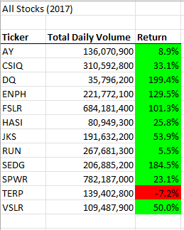
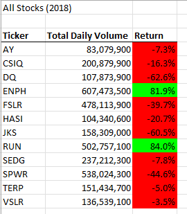

# Stock Analysis
Steve is a financial analyst doing stock research for his parents who are interested in investing in Green Energy stocks. 

## Overview of Project
Steve's parents have put all of their money into DAQO New Energy (DQ) and Steve is worried about the lack of diversity in their portfolio. He has provided historical green energy companies stock volumes and prices for 2017 and 2018 in Excel format. Steve has requested help in quickly analyzing the different companies stock performance over the two year periods.

### Purpose
#### Client Perspective
Analyze DAQO stock performances versus the other 11 green energy companies stock performance. Provide analysis and recommendations.

#### Analyst Perspective
Utilize an existing VBA script and refactor the script to be more efficient. 

### Results
#### Analysis
Historical green energy stock prices were summarized for trading volume and return percentage with the following results:

DAQO (DQ) performed well in 2017 with an overall return just under 200%. However the volume of stock traded was by far the lowest of the peer group at 35.8M shares. 2018 saw a much higher volume of DAQO stock traded but had a negative 62.6% return. Total return over 2017 and 2018 was 17.8%.

Diversifaction of the stock portfolio is recommended with ENPH and RUN stocks good candidates with high volumes and positive returns in both 2017 and 2018.

##### Code
Original VBA code had nested for loops that would run through the entire stock data, calculate and write the individual stock's performance and then repeat the process 11 more times:

    'set up stock ticker array
        Dim tickers(11) As String

        tickers(0) = "AY"
        tickers(1) = "CSIQ"
        tickers(2) = "DQ"
        tickers(3) = "ENPH"
        tickers(4) = "FSLR"
        tickers(5) = "HASI"
        tickers(6) = "JKS"
        tickers(7) = "RUN"
        tickers(8) = "SEDG"
        tickers(9) = "SPWR"
        tickers(10) = "TERP"
        tickers(11) = "VSLR"

        'initialize variables for starting and ending prices
        Dim startingPrice As Double
        Dim endingPrice As Double

        Worksheets(yearValue).Activate

       'Find number of rows (before both loops)
       RowCount = Cells(Rows.Count, "A").End(xlUp).Row

       'loop through tickers

        For i = 0 To 11

            ticker = tickers(i)

            totalVolume = 0

            'loop through rows

            Worksheets(yearValue).Activate

            For j = 2 To RowCount

                'calc volume
                If Cells(j, 1).Value = ticker Then

                    totalVolume = totalVolume + Cells(j, 8).Value

                End If

                'set Start Price
                If Cells(j, 1).Value = ticker And Cells(j - 1, 1).Value <> ticker Then

                    startingPrice = Cells(j, 6).Value

                End If

                'set End Price
                If Cells(j, 1).Value = ticker And Cells(j + 1, 1).Value <> ticker Then

                    endingPrice = Cells(j, 6).Value

                End If

            Next j

        'Output results
        Worksheets("All Stock Analysis").Activate

        Cells(4 + i, 1).Value = ticker

        Cells(4 + i, 2).Value = totalVolume

        Cells(4 + i, 3).Value = endingPrice / startingPrice - 1

        Next i
        
